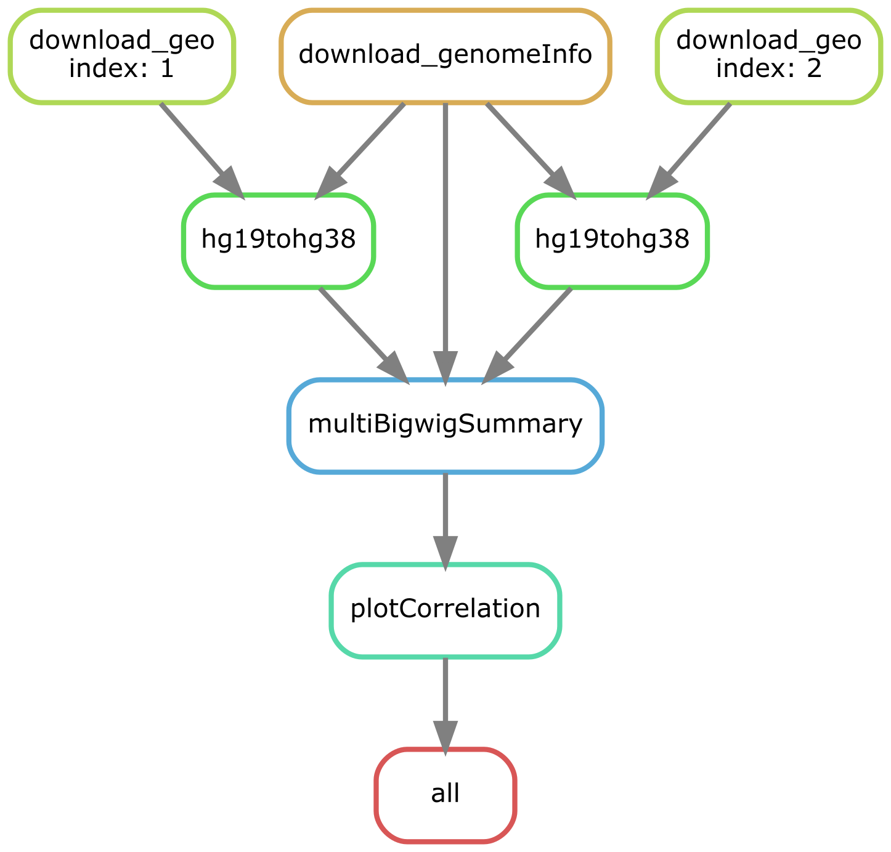

```{r setup, eval = TRUE, include=FALSE,cache=FALSE}
knitr::opts_chunk$set(eval = FALSE, echo=TRUE)

library(RefManageR)
BibOptions(check.entries = FALSE,
           bib.style = "numeric",
           cite.style = "numeric",
           style = "markdown",
           hyperlink = FALSE,
           dashed = FALSE)
bib <- ReadBib("./bibliography/ref.bib", check = FALSE)
```

## What motivates a pipeline automation? 

--

- Reproducibility is the key in scientific computing. 

--

- A bioinformatic pipeine requires
  + various tools written in different languages and 
  + packages that keep evolving.

--

- To this end, a workflow manager bridges the needs and at the same time
  + enables easy scaling up and 
  + improve code reusability, thus improving toubleshoot experience.
  + works well with `sbatch` and parallel processing. 

---
background-image: url(https://snakemake.github.io/img/jk/logo.png)
class: inverse, center, middle

---

- Snakemake `r AutoCite(bib, 'koster_snakemakescalable_2012')` was inspired by `GNU make` and was written in python (python is a type of snake!). 

--

- The original article has [1k+ citations](https://scholar.google.com/scholar_lookup?title=Snakemake--a%20scalable%20bioinformatics%20workflow%20engine&publication_year=2012&author=J.%20K%C3%B6ster&author=S.%20Rahmann) and is popular in bioinforatics. 

--

- There are various workflow management systems, such [Galaxy](https://usegalaxy.org/) and [Common Workflow Language](https://www.commonwl.org/). 

--

- What makes snakemake stands out, in my opinion, is its seamless interaction with **python and conda**. 

--

- Here is the snakemake flavor of Kallisto workflow. 
```{python eval=FALSE}
# construct a lookup table to match the output dir to input.    
import pandas as pd
stbl = pd.read_table("data/sra_info.tab", sep = '\t',  dtype=str).set_index("Run", drop = False)
# more python code to do data munging 

rule all:
    input:
        expand("results/{sample}", sample = stbl['newdir'])

# rule kallisto_index:...
rule kallisto_quan:
    input:
        lambda wildcards: stbl.loc[stbl['newdir'] == wildcards.sample, 'inputfq']
    output:
        directory("results/{sample}")
    conda:
        "envs/kallisto.yaml"
    params:       
        idx = expand("data/{idx}", idx = config["idx"]),
    shell:
        "kallisto quant -i {params.idx} -o {output} --single -l 300 -s 30 {input}"
```

---

## Visualizing BigWig to uncover hotspots/coldspots of DNA damage. 

--
.pull-left[
- DNA is prone to environmental and endogenous damages `r AutoCite(bib, 'mingard_next-generation_2020')`. 


- To assess a damage on replication and transcription, genome-wide mapping reveals the prefered damage sites. 


- As a result of mapping and alignment, BigWig is generated to capture information on read alignment intensity. 
] 


--


.pull-right[

[Adapted from Deeptools](http://gensoft.pasteur.fr/docs/deepTools/2.4.2/index.html)
]

---
background-image: url(plots/plotCorrelation_page.png)
class: center, middle
background-size: contain
---


## File system and pipline overview. 

.left-column[ 
```{bash}
.
|-- README.md
|-- Snakefile
|-- WRAPPER_SLURM
|-- acc.tab
|-- config.yaml
|-- data -> /bigdata/
|-- envs
|   |-- bw_convert.yaml
|   `-- deeptools.yaml
`-- results

3 directories, 7 files
```

]

--

.right-column[



output `snakemake --dag -n -- all | dot -Tpng > dag.png`. 
]

---
## A general design principle (based on my experience so far.)

--

1. Starting with a toy dataset to run pipeline interactively (bash, python, R). 

--

2. Scaling up and generalization. 
  + Utilizing the `--printshellcmd` tag to view the actual cmdlines after expansion. 
  + `from snakemake.io import expand` to import and play around expand function
  + `import yaml` and `config = yaml.load()` to test interaction with yaml. 

--

3. works with configuration to nail down your environment.  

---
class: center, middle
background-size: contain

## Sounds like linear but it's in fact iterative

---
class: center, middle
background-size: contain
## and sometimes can be quite daunting...

---

--

- an `awk` line I need to [fix the overlapping intervals](https://www.biostars.org/p/81185/)
```{bash}
awk -v OFS="\t" "{ print $1, $2, $3, ".", $4 }" data/1.sorted.bedGraph > data/1.awk.bedGraph
```

--

- output of `snakemake --printshellcmd`, i.e.after snakemake expansion.
```{bash}
awk -v OFS="\t" "{ print \$1, \$2, \$3, \".\", \$4 }" data/1.sorted.bedGraph > data/1.awk.bedGraph 
```

--

- the line in `Snakefile`...
```{bash}
awk -v OFS="\\t" "{{ print \$1, \$2, \$3, \\".\\", \$4 }}" {output.hg38_sorted_bedgraph} > {output.hg38_awk_bedgraph}
```

--

### Trial-and-error backward helps!

---

## Problems

--

- `wget -A '<wildcard>' -O <outputName> <FTP>` does not seem to work well when paralleled. 

--

  + I believe paralleling might mess up the wildcard-FTP pairs. 

--

  + **Workaround**: separate the download rule from the main rule and use single core for downloading. Slowly by surely!
  
--

- Tempted to produce a human readable intermediate filename. 

--

  + this will complicate the lookup (**a lot**). Too much to handle for a snakemake newbie! 

--

  + **Workaround**:         
    1) use unique indices to name intermediate files and    
    2) simplify lookup by coming up with all the sample attributes (and combination) by `pandas`. 

---

## Acknowledgement

--

- Dr. Stajich for showing the way to python and command lines world.

--

- Dear follow classmates to create a conducive piazza environment. 

---

class: inverse, center, middle
background-size: contain
# Thank you for your attention! 

--

## Welcome to pull requests my code at [odingsy/gen220_finalProj](https://github.com/odingsy/gen220_finalProj)
---
class: inverse
# Reference 
```{r refs, eval = TRUE, echo=FALSE, results="asis"}
PrintBibliography(bib)
```
