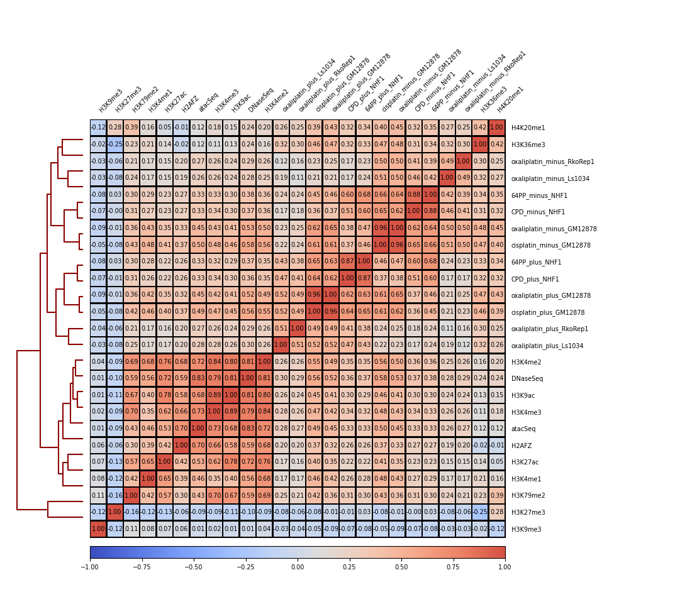

```{r chunkSetup,include=FALSE}
def.chunk.hook  <- knitr::knit_hooks$get("chunk")
knitr::knit_hooks$set(chunk = function(x, options) {
  x <- def.chunk.hook(x, options)
  ifelse(options$size != "normalsize", paste0("\n \\", options$size,"\n\n", x, "\n\n \\normalsize"), x)
}) # https://stackoverflow.com/questions/25646333/code-chunk-font-size-in-rmarkdown-with-knitr-and-latex


library(RefManageR)
BibOptions(check.entries = FALSE,
           bib.style = "numeric",
           cite.style = "numeric",
           style = "markdown",
           hyperlink = TRUE,
           dashed = FALSE)
bib <- ReadBib("./bibliography/ref.bib", check = FALSE)

knitr::opts_chunk$set(eval = FALSE, echo = TRUE, warning = FALSE, message = FALSE, fig.align = 'center', size = "scriptsize", python.reticulate = FALSE)
```

### Introduction
Interval correlation analysis is one of the key analysis of genome wide sequencing data. It reveals proximity between features of interest to a set of well-studied genomic features. Correlation quantified how good the two sets of interval overlaps. 

Genomic interval could be boiled down a region with high read alignment density. In this project, I examined the genomic intervals generate by excision repair-sequencing (XR-seq) `r AutoCite(bib, 'hu_genome-wide_2019')`. This type of sequencing reveal hotspots of DNA repair on a specific damage through a two-step pulldown, targeting sequentially the repair and the damage. After damage reversal, sequencing library is constructed (as shown in Scheme A&C. Figure adapted from `r AutoCite(bib, 'hu_genome-wide_2015')`). Because the repair captures single strand DNA, XR-seq is strand-specific. 


The data is deposited on Gene Expression Omnibus(GEO) as BigWig format. [BigWig](https://genome.ucsc.edu/goldenpath/help/bigWig.html) is a file type developed by UCSC Genome Browser to capture genomic interval. It is binary and comprises with continuous equidistance intervals that are readily displayed by Genome Browser. 

As a public data mining project, Snakemake `r AutoCite(bib, 'koster_snakemakescalable_2012')` automates download, processing and visualization to aid human interpretation. Snakemake's reproducibility comes from its seamless integration with conda while its resoure management leads to an effortless scale-up of a pipeline. 


### The design principles
The input is sample table `acc.tab` and output is a pairwise pearson correlation heatmap. Here is the `acc.tab` for the current project (taking away column with FTP and add sources of reference). 

| sample      	| genome 	| cellline 	| label       	| Sources                                      	|
|-------------	|--------	|----------	|-------------	|----------------------------------------------	|
| GSM4386818  	| hg38   	| Ls1034   	| oxaliplatin 	| `r AutoCite(bib, 'vaughn_genome-wide_2020')` 	|
| GSM4386808  	| hg38   	| RkoRep1  	| oxaliplatin 	| `r AutoCite(bib, 'vaughn_genome-wide_2020')` 	|
| GSM2186625  	| hg19   	| GM12878  	| cisplatin   	| `r AutoCite(bib, 'hu_cisplatin_2016')`       	|
| GSM2186627  	| hg19   	| GM12878  	| oxaliplatin 	| `r AutoCite(bib, 'hu_cisplatin_2016')`       	|
| GSM1985845  	| hg19   	| NHF1     	| CPD         	| `r AutoCite(bib, 'adar_genome-wide_2016')`   	|
| GSM1985857  	| hg19   	| NHF1     	| 64PP        	| `r AutoCite(bib, 'adar_genome-wide_2016')`   	|
| ENCFF977NNH 	| hg38   	| GM12878  	| atacSeq     	| ENCSR095QNB                                  	|
| ENCFF428XFI 	| hg38   	| GM12878  	| DNaseSeq    	| ENCSR000EMT                                  	|
| ENCFF836XOQ 	| hg38   	| GM12878  	| H3K4me1     	| ENCSR000AKF                                  	|
| ENCFF480KNX 	| hg38   	| GM12878  	| H3K4me3     	| ENCSR057BWO                                  	|
| ENCFF701JXT 	| hg38   	| GM12878  	| H3K4me2     	| ENCSR000AKG                                  	|
| ENCFF776JKS 	| hg38   	| GM12878  	| H3K9ac      	| ENCSR000AKH                                  	|
| ENCFF174RRQ 	| hg38   	| GM12878  	| H3K9me3     	| ENCSR000AOX                                  	|
| ENCFF691LFQ 	| hg38   	| GM12878  	| H3K27me3    	| ENCSR000AKD                                  	|
| ENCFF798KYP 	| hg38   	| GM12878  	| H3K27ac     	| ENCSR000AKC                                  	|
| ENCFF397UEP 	| hg38   	| GM12878  	| H3K36me3    	| ENCSR000DRW                                  	|
| ENCFF862NNR 	| hg38   	| GM12878  	| H3K79me2    	| ENCSR000AOW                                  	|
| ENCFF662PHQ 	| hg38   	| GM12878  	| H2AFZ       	| ENCSR000AOV                                  	|
| ENCFF084LTI 	| hg38   	| GM12878  	| H4K20me1    	| ENCSR000AKI                                  	|

To run the pepline, `sbatch WRAPPER_SLURM` at root directory. It will initialize on `short` node with 16 CPUs and 16Gbs memory. The whole workflow with current `acc.tab` takes about 15min to finish. 

The actual snakemake process startes with data munging of the sample table `acc.tab`. For the GEO data, each GSM sample/FTP address contains a plus and minus bigWig files while each ENC sample/HTTPS address contains a single file. To give each bigWig file an index, I selectively applied `pandas.melt` on sample name starts with `GS`, filled up the empty cell in `ENC` with `nump.nan` and concatinated the two. I chose to build a index for file names(as `index`: string, start with '1'), instead of using pandas index, becasue string but not number is recognized as filename by snakemake. 

I implemented two filters to apply each rule selectively on a subset of inputs. The first filter selectively download samples with sample name starting with `GS`. This filter is realized with pandas filtering in [the target rule](https://snakemake.readthedocs.io/en/stable/tutorial/basics.html#step-7-adding-a-target-rule) and a local wildcard constraints.
```{python}
rule download_bw:
	output:
		'data/{index}.bigWig'
	params:
		accept = lambda wc: stbl.loc[stbl['index'] == wc.index, 'strand'].replace(acceptName).tolist()
	wildcard_constraints:
		 index = '|'.join([escape(x) for x in stbl.loc[stbl['sample'].str.startswith('GS'), 'index']])
	shell:
		"""
		wget --no-remove-listing -r -nd -A '{params.accept}' -O {output} {params.ftp}
		"""

############# The final rule. run with `snakemake -- all`. 
rule all:
	input:
		expand(rules.download_bw.output, index = stbl.loc[stbl['sample'].str.startswith('GS'), 'index'].tolist())
```

The second filter differentiates the aligned genomes (hg19 or hg38) and apply Rule 'hg19tohg38' to inputs that has aligned to hg19 genome. This filter is realized by a shell script, which transformed both groups of inputs parallelly through the [liftover function](https://www.biostars.org/p/81185/#476941) or a renaming function `mv`. 
```{python}
rule hg19tohg38:
	input:
		hg19_bw = 'data/{index}.bigWig'
	output:
		hg38_bw = 'data/{index}_hg38.bigWig'
	params:
		genome = lambda wc: stbl.loc[stbl['index'] == wc.index, 'genome'].tolist() 
	shell:
		"""
		if [ {params.genome} == 'hg19' ]
		then
		  ## a liftover script to convert translated from {input.hg19_bw} to {output.hg38_bw}
		  rm -f {input.hg19_bw} 
		elif [ {params.genome} == 'hg38' ]
		then
		  mv {input.hg19_bw} {output.hg38_bw}
		else
			echo "genome is {params.genome}"
		fi
		"""
```

I have tried but failed to address the `wget -A -O <FTP>`. Briefly, `wget -A -O` is a filter-rename process where I search a filename pattern (`-A '*PLUS*,*plus*'`) and save as a specific name (`-O xxx_plus.bigWig`). When run `snakemake --cores all` on `download_bw` rule, there would be random files that either failed to be downloaded or left with an empty file at the end of the process. This process could only be prevented with `snakemake --cores 1`. Since there is no rule specific equivalent of `--cores 1` to my knowledge, I have workarounded by running two snakemake processes: the 1st download process uses a singe core followed by the 2nd process with all cores. This solution is not optimal; [snakemake interaction with FTP](https://snakemake.readthedocs.io/en/stable/snakefiles/remote_files.html#file-transfer-protocol-ftp) and [Portable Encapsulated Projects(PEP)](http://pep.databio.org/en/latest/) are two directions for future exploration.

### Interpreting the result

The repair of all damages happens at open chromatin regions while cisplatin and oxaliplaitin repair seem to have stronger positive correlation with open chromatin regions than the repair of UV damages or . Cell lineage is a deterministric factor of that determine  correlation with chromatin openness. Moreover, strand bias is a strong determinstic factor to interval correlation as opposed to damage types.  
 



### In conclusion
Snakemake is a powerful in streamlining biological interpretation. It could combine advantages across different programming languages and requires continuous practices to uncover its full potential.  


### References
```{r refs, eval = TRUE, echo=FALSE, results="asis"}
PrintBibliography(bib)
```